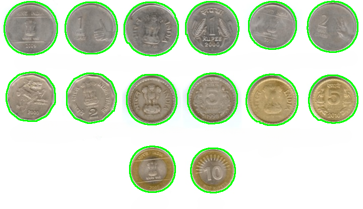
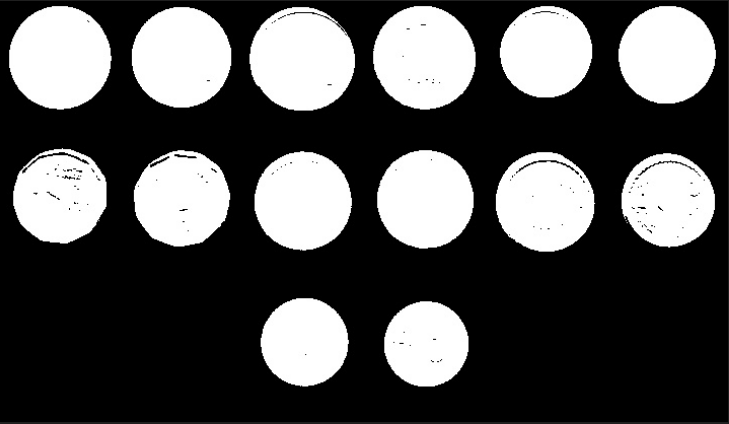
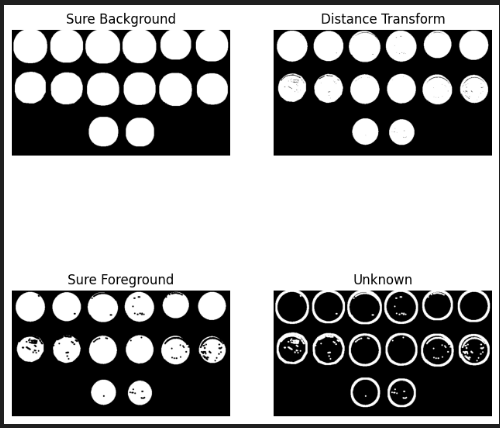
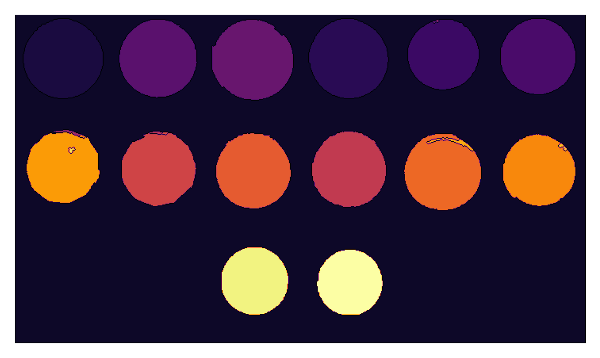
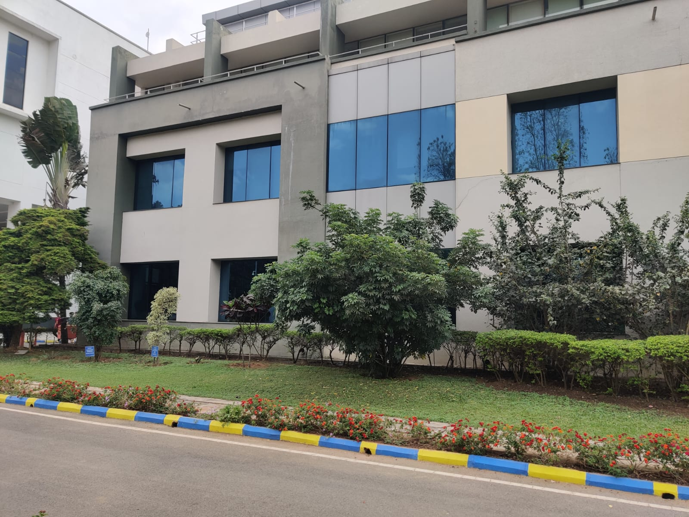
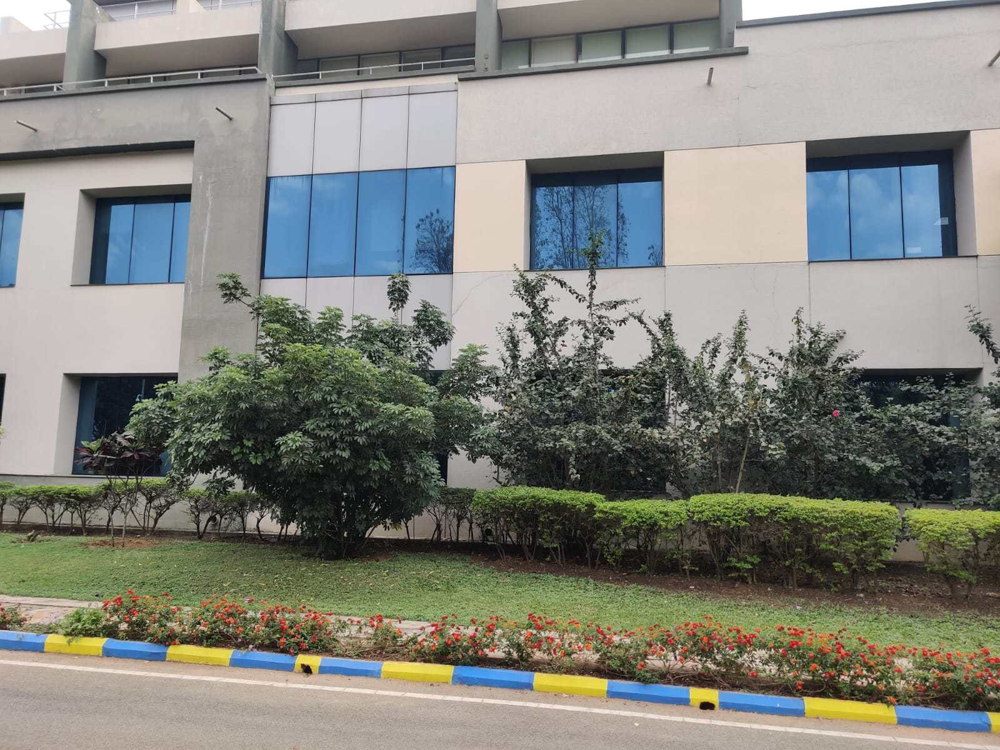
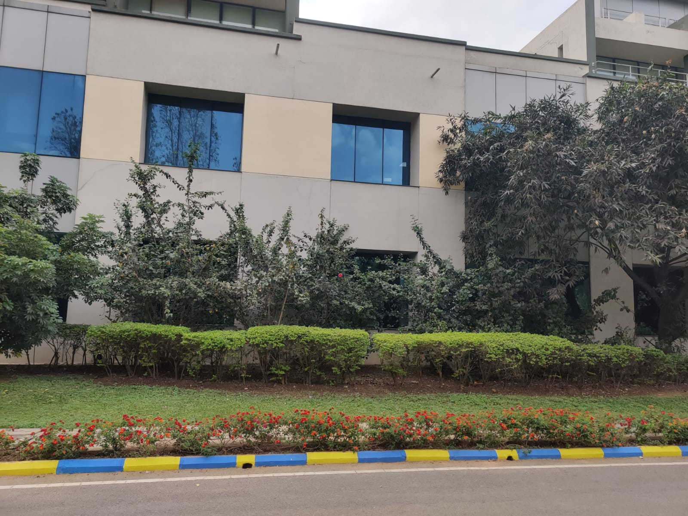
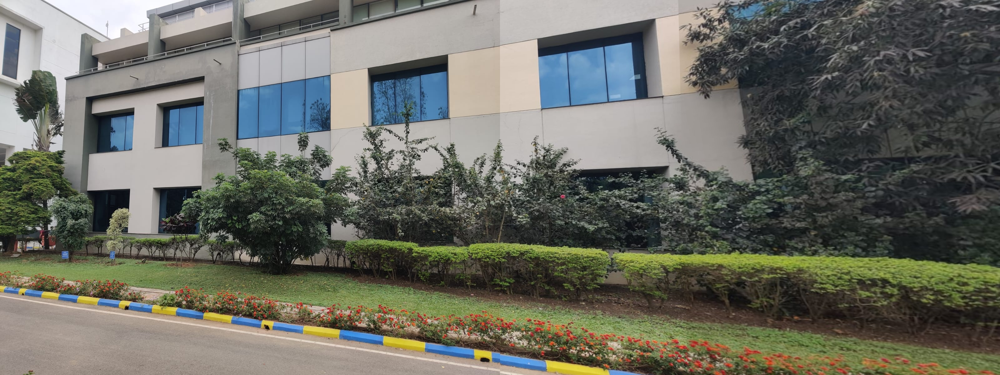

# **Coin Detection & Image Stitching using Computer Vision**


## **Part 1: Coin Detection & Segmentation**

### **a. Detecting all coins in the image**

- Converting the input image to **grayscale** to remove color dependency.This step is necessary because edge detection and contour detection work better on grayscale images.
- Applying **Gaussian Blur** to smooth the image and remove unwanted noise and helps in better edge detection.Parameters used are (3,3) The kernel size and 0 The standard deviation of the Gaussian function
- Using **Canny edge detection** to highlight the boundaries of the coins.It finds the edges in an image based on intensity changes. Considered 30 as lower threshold and 100 as upper threshold which gave the best results.
- **Dilation** to strengthen edges. It thickens the edges detected by Canny edge detection.The dilation is applied 5 times to make edges thicker.
- **Finding and drawing Contours** Using the findcontours and drawcontours operations. Helps in object detection and segmentation.



### **b. Segmentation using the Watershed Algorithm**
- Converting the input image to **grayscale**.Reduces complexity for thresholding and segmentation.
- Apply **Otsu’s thresholding** to separate the foreground (coins) from the background. Automatically finds the best threshold valueand convert grayscale image into a binary image (black & white). Foreground = white and background = black.


- Use **Morphological operations** to remove noise.Removes noise by erosion followed by dilation.
- **Computing different regions** 
   - Finding the Sure Background Area - Dilation expands white regions to ensure the background is identified. Usinf 5 iterations to ensure the background is fully covered.
   - Computiong Distance Transorm - It finds the distance of each white pixel from the nearest black pixel. This helps to separate overlapping objects.
   - Finding the Sure Foreground area - Thresholding the distance transform image helps identify foreground objects.
   - Identifying the Unknown Region - This is Background - Foreground and represents reas that could belong to either background or foreground.


- **Watershed algorithm** 
   - Marker Labelling for Watershed Algorithm - Labels connecte foreground regions with unique numbers.
   - Watershed Algorithm separates objects by treating the grayscale image like a topographic map. The "inferno" colormap highlights different segments clearly.




#### **c. Counting the Coins**
- Each contour corresponds to a separate coin .
- Total number of detected contours, directly gives the number of coins in the image.


---

## **Part 2: Image Stitching**

#### 1. Detecting and Matching Keypoints 
- Using **SIFT (Scale-Invariant Feature Transform)** to detect keypoints and compute descriptors in both images.
- Converting images to grayscale since keypoint detection works better in a single-channel format.
- Useing FLANN-based matching (Fast Library for Approximate Nearest Neighbors) to find correspondences between keypoints.
- Applying Lowe’s ratio test to filter good matches by ensuring the best match is significantly better than the second-best match.

#### **2. Computing Homography**
- Extracting the coordinates of matching keypoints from both images.
- Using **RANSAC (Random Sample Consensus)** to find the best homography matrix H, which defines the transformation between two images.
- This transformation helps in aligning the images correctly.

#### **4. Warping & Stitching**
- Initializes the second image as the base image.
- Iterates over remaining images:
   1. Detects keypoints and matches them with the base image.
   2. Computes the homography matrix to warp the new image onto the base image.
   3. Applying transformationa nd overlaying base image onto the warped image.

### **5. Remove black borders** 
- Croping the black regions by detecting the bounding box of the valid stitched region.

### **Output Example**
<p align="center">
  
  
  
</p>
A stitched panorama from multiple images:



---

## **Installation & Requirements**

Before running the code, install the required libraries:

```bash
pip install opencv-python numpy matplotlib
```

Ensure that the following dependencies are installed:
- `opencv-python`
- `numpy`
- `matplotlib` (for visualization)

---

## **How to Run the Code**

### **1. Running Coin Detection**
- Place your image in the project directory.
- Update the filename in the script (`coin_detection.py`).
- Run the script:

```bash
python coin_detection.py
```

- The output will display:
  - The detected coins outlined in the image.
  - The total number of coins counted.

### **2. Running Image Stitching**
- Place **three overlapping images** (`image1.jpg`, `image2.jpg`, `image3.jpg`) in the project directory.
- Run the following command:

```bash
python image_stitching.py
```

- The final panorama will be displayed and saved as **stitched_panorama.jpg**.
